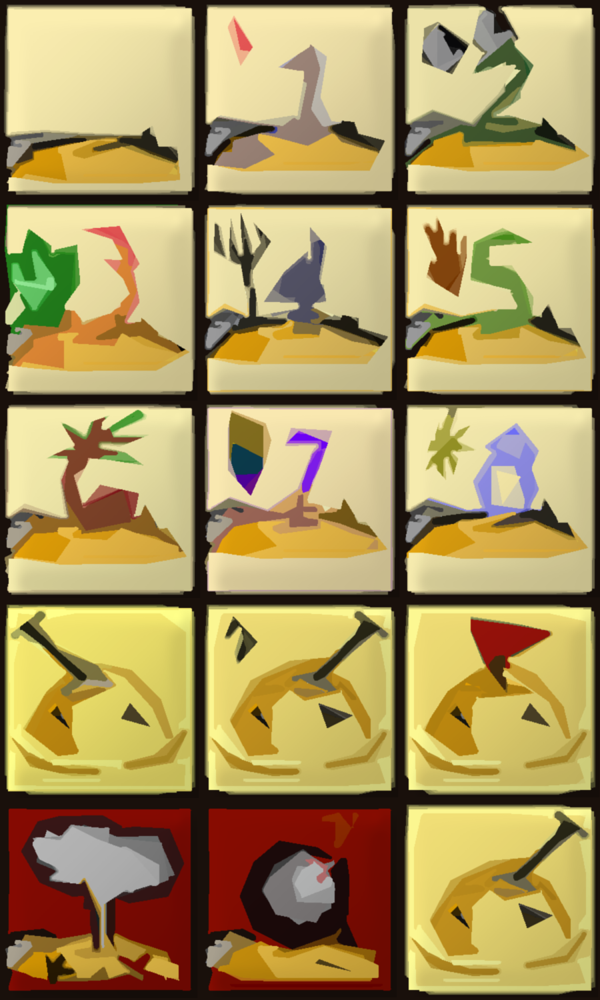

# Minesweeper

## Running the program

### Windows
  Run `mines.exe` file

### Mac

  1. Run `make` 
  2. Then `./mines`

## Screenshots

Below are some in-game screenshots:

</img>

</img>

## Implementation

### Data structures
Program makes use of three 2D arrays to store the following information:
 * Number of neighbouring bombs (any number >=9 signifies bomb within itself) 
 * Boolean cover (whether or not the tile has been revealed)
 * Tile icon (whether the tile has been flagged/marked)

### Algorithms

I considered two algorithms for implementing this:
#### Breadth-first search
How it works:
 * Start opening adjacent tiles after the user has chosen a tile to click.
 * Uses breadth-first search algorithm to look for all the tile nearby until numbered tiles are found.
Pros:
 * Implementation is simplest
Cons:
 * Takes a while to load when number of tiles to be opened is large.

#### Breadth-first search
Alternative implementation (original idea):
How it works:
 * Identify tiles within the same “island” (group of tiles surrounded by numbered tiles in standard Minesweeper game) before game starts
 * Use union-find algorithm to find all these tiles
 * Not possible to implement simply as certain numbered tiles could belong to different islands depending on how the user clicks on the tiles during the game.
 

## Customizability

### Variables

The following are variables that can be edited in mines.cpp file:
 * `WIDTH`and `HEIGHT` - number of tiles in the Minesweeper board 
 * `BOMBS` - number of bombs planted into the game
 * `char * SKINTYPE` - source file name for Minesweeper skin
 * `sTS` - how many pixels is one tile of source image
 * `TS` - tile size as seen by viewer.

### Tile design

Not the best tile-design in the world, but here are some I drew:

 (Tile size: 24)
</img> (Tile size: 200)
 
## Tutorial credits

### SFML tutorial
Coding Made Easy: https://www.youtube.com/channel/UCas000yWtwjvFzD2zB9Nzmw
